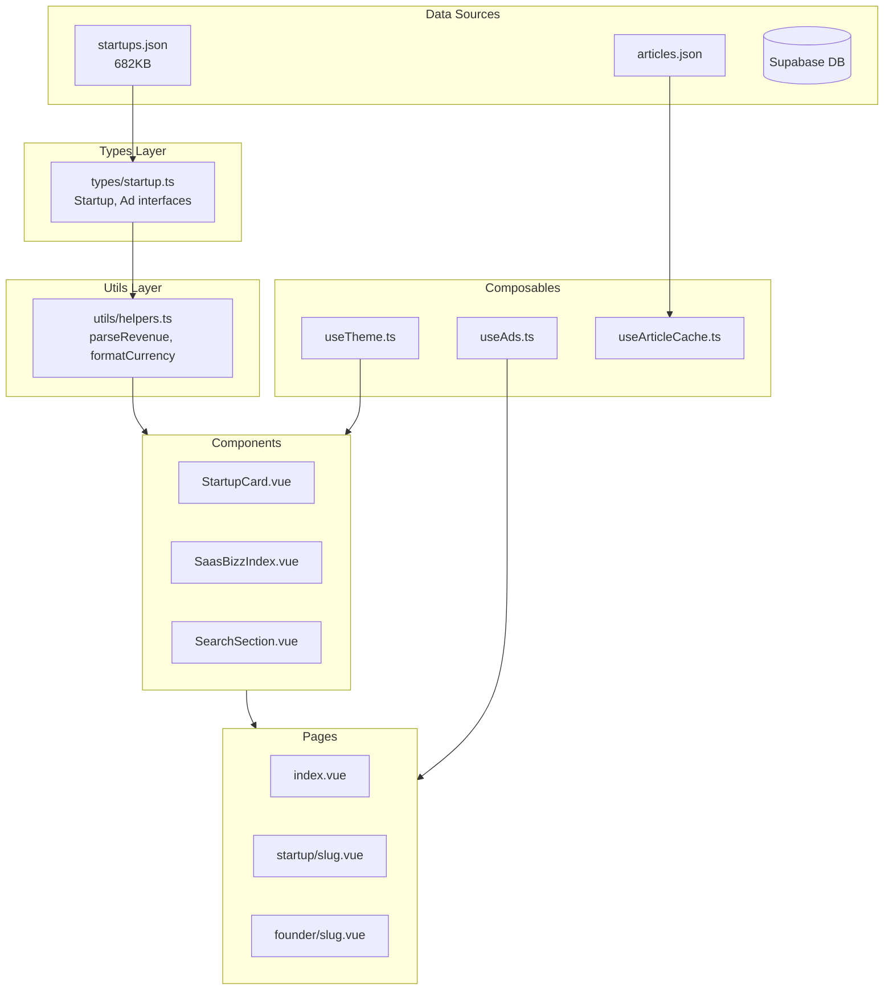

# CODEMAP - SaaSBizz

> Last updated: 2026-01-18 18:25
> Generated by: Codemap Updater Skill

## Overview

**SaaSBizz** is a verified SaaS leaderboard platform that displays startups ranked by revenue. The platform shows real MRR (Monthly Recurring Revenue) data from founders building in public, featuring startup profiles, founder information, and financial metrics.

## Tech Stack

| Technology | Version/Details |
|------------|-----------------|
| **Framework** | Nuxt 4.2.2 |
| **Frontend** | Vue 3.5.25 |
| **Language** | TypeScript (strict mode) |
| **Styling** | Tailwind CSS 6.14 |
| **Routing** | Vue Router 4.6.4 |
| **Image Optimization** | @nuxt/image 2.0.0 |
| **Build** | Static Site Generation (SSG) |
| **Hosting** | Bluehost (shared hosting) |

## Directory Structure

```
saasbizzgemi/
├── .agent/                  # Workflow definitions
│   └── workflows/           # Custom workflow scripts
├── assets/
│   └── css/main.css         # Global styles
├── components/              # Vue components (11 files)
├── composables/             # Vue composables (3 files)
├── content/                 # Static JSON data
│   ├── startups.json        # Main startup data (683KB)
│   ├── articles.json        # Blog articles
│   └── sponsors.json        # Sponsor data
├── layouts/                 # Page layouts (2 files)
├── pages/                   # Route pages (10+ files)
│   ├── index.vue            # Homepage
│   ├── admin.vue            # Admin panel
│   ├── startup/[slug].vue   # Dynamic startup detail
│   └── founder/[slug].vue   # Dynamic founder profile
├── public/                  # Static assets
│   └── founder_images/      # Founder profile images
├── server/                  # API endpoints
│   └── api/                 # Server routes
├── types/                   # TypeScript definitions
│   └── startup.ts           # Core interfaces
├── utils/                   # Helper functions
│   └── helpers.ts           # Utility functions
├── nuxt.config.ts           # Nuxt configuration
└── CLAUDE.md                # AI assistant context
```

---

## Components

### Core UI Components

| Component | Path | Purpose |
|-----------|------|---------|
| [SaasBizzIndex.vue](file:///c:/git-clone/saasbizzgemi/components/SaasBizzIndex.vue) | `components/` | Live ticker showing top startups with MRR and growth |
| [StartupCard.vue](file:///c:/git-clone/saasbizzgemi/components/StartupCard.vue) | `components/` | Card displaying startup info (logo, name, founder, revenue, growth) |
| [SearchSection.vue](file:///c:/git-clone/saasbizzgemi/components/SearchSection.vue) | `components/` | Search and category filtering UI |
| [NewsBox.vue](file:///c:/git-clone/saasbizzgemi/components/NewsBox.vue) | `components/` | News/articles display section |

### Utility Components

| Component | Path | Purpose |
|-----------|------|---------|
| [LoadingSkeleton.vue](file:///c:/git-clone/saasbizzgemi/components/LoadingSkeleton.vue) | `components/` | Loading placeholder animations |
| [ErrorBoundary.vue](file:///c:/git-clone/saasbizzgemi/components/ErrorBoundary.vue) | `components/` | Error handling wrapper |
| [Pagination.vue](file:///c:/git-clone/saasbizzgemi/components/Pagination.vue) | `components/` | Pagination controls |
| [AdCard.vue](file:///c:/git-clone/saasbizzgemi/components/AdCard.vue) | `components/` | Advertisement card display |
| [ThemeSwitcher.vue](file:///c:/git-clone/saasbizzgemi/components/ThemeSwitcher.vue) | `components/` | Blue/white theme toggle |

### Feature Components

| Component | Path | Purpose |
|-----------|------|---------|
| [ValuationCalculator.vue](file:///c:/git-clone/saasbizzgemi/components/ValuationCalculator.vue) | `components/` | SaaS valuation calculator tool |
| [FeaturedVideo.vue](file:///c:/git-clone/saasbizzgemi/components/FeaturedVideo.vue) | `components/` | Embedded video player |

---

## Pages & Routes

| Page | Route | Description |
|------|-------|-------------|
| [index.vue](file:///c:/git-clone/saasbizzgemi/pages/index.vue) | `/` | Homepage with Top Earners + Recently Added sections |
| [admin.vue](file:///c:/git-clone/saasbizzgemi/pages/admin.vue) | `/admin` | Admin dashboard (35KB) |
| [login.vue](file:///c:/git-clone/saasbizzgemi/pages/login.vue) | `/login` | Authentication page |
| [recent.vue](file:///c:/git-clone/saasbizzgemi/pages/recent.vue) | `/recent` | Recently added startups |
| [search.vue](file:///c:/git-clone/saasbizzgemi/pages/search.vue) | `/search` | Search results page |
| [tos.vue](file:///c:/git-clone/saasbizzgemi/pages/tos.vue) | `/tos` | Terms of Service |
| `startup/[slug].vue` | `/startup/:slug` | Dynamic startup detail page |
| `founder/[slug].vue` | `/founder/:slug` | Dynamic founder profile page |
| `news/` | `/news/*` | News/articles section |
| `advertise/` | `/advertise/*` | Advertising pages |

---

## Layouts

| Layout | Path | Purpose |
|--------|------|---------|
| [default.vue](file:///c:/git-clone/saasbizzgemi/layouts/default.vue) | `layouts/` | Main layout with header, sidebar ads, footer |
| [noads.vue](file:///c:/git-clone/saasbizzgemi/layouts/noads.vue) | `layouts/` | Clean layout without ads |

---

## Composables

| Composable | Path | Purpose | Exports |
|------------|------|---------|---------|
| [useAds.ts](file:///c:/git-clone/saasbizzgemi/composables/useAds.ts) | `composables/` | Ad rotation logic (8-second intervals) | `adGroupIndex`, `currentRightAds` |
| [useTheme.ts](file:///c:/git-clone/saasbizzgemi/composables/useTheme.ts) | `composables/` | Blue/white theme management | `themeColor`, `setTheme`, `toggleTheme` |
| [useArticleCache.ts](file:///c:/git-clone/saasbizzgemi/composables/useArticleCache.ts) | `composables/` | In-memory article caching | `getArticle`, `getAllArticles`, `clearCache` |

---

## Types & Interfaces

### [startup.ts](file:///c:/git-clone/saasbizzgemi/types/startup.ts)

```typescript
// Core startup data structure (from Supabase saasbizz_dir table)
interface Startup {
  id: number
  startup_name: string | null
  tagline: string | null
  total_revenue: number | null        // Numeric (new schema)
  mrr: number | null                   // Numeric (new schema)
  mom_growth: number | null            // Month-over-month growth %
  founder_name: string | null
  founder_image_local_path: string | null
  domain: string | null                // Primary domain field
  trustmrr_link: string | null         // TrustMRR profile link
  trustmrr_profile_url?: string        // URL slug for routing
  category: string | null
  full_description: string | null
  // ... 20+ additional fields
}

// Advertisement data
interface Ad {
  id: number
  name: string
  emoji: string
  copy: string
  bg: string
  href?: string
}
```

---

## Utilities

### [helpers.ts](file:///c:/git-clone/saasbizzgemi/utils/helpers.ts)

| Function | Signature | Purpose |
|----------|-----------|---------|
| `parseRevenue` | `(val: string \| number \| null) => number` | Parse `"$116,350"` → `116350` |
| `formatCurrency` | `(val: number \| string \| null) => string` | Format `12000` → `"$12,000"` |
| `getFounderSlug` | `(name: string \| null) => string` | Convert `"John Doe"` → `"john-doe"` |
| `isValidFounder` | `(name: string \| null) => boolean` | Check if founder name is valid |
| `formatFollowers` | `(count: number \| string \| null) => string` | Format `1910` → `"1.9k"` |
| `isValidGrowth` | `(growth: string \| number \| null) => boolean` | Validate growth values |

---

## Server API

### Endpoints

| Endpoint | Method | Path | Purpose |
|----------|--------|------|---------|
| `import-article.post.ts` | POST | `/api/import-article` | Import new articles |
| `scan-articles.get.ts` | GET | `/api/scan-articles` | Scan and list articles |
| `submit-advert.post.ts` | POST | `/api/submit-advert` | Submit advertisement request |
| `submit-sponsor.post.ts` | POST | `/api/submit-sponsor` | Submit sponsorship request |
| `webhook/` | Various | `/api/webhook/*` | Webhook handlers |

---

## Data Flow



---

## Configuration

### [nuxt.config.ts](file:///c:/git-clone/saasbizzgemi/nuxt.config.ts)

Key settings:
- **SSR**: Enabled for static generation
- **Prerender**: Explicit routes for startups/founders (no crawling)
- **Trailing slashes**: Enabled for Bluehost compatibility
- **Image optimization**: WebP + JPG @ 80% quality
- **HMR port**: 24679

### Environment Variables

| Variable | Purpose |
|----------|---------|
| `SUPABASE_URL` | Supabase project URL |
| `SUPABASE_KEY` | Supabase anon/service key |

---

## Workflows

Available commands (in `.agent/workflows/`):

| Command | Description |
|---------|-------------|
| `/dev` | Start Nuxt dev server on port 3000 |
| `/build` | Generate static site for production |
| `/new-component` | Create new component with SaaSBizz patterns |
| `/new-page` | Create new page with standard structure |
| `/new-api` | Create new API endpoint |
| `/quality-check` | Run code quality checks |
| `/refactor-clean` | Clean up and refactor codebase |
| `/test-coverage` | Run tests with coverage |
| `/e2e` | Run end-to-end tests |
| `/kill-ports` | Kill processes on 3000/3001 |

---

## Key Architectural Decisions

1. **Static Site Generation**: Pre-renders all startup/founder pages at build time for fast loading and SEO
2. **JSON Data Source**: Uses local JSON for startup data (synced from Supabase) to enable SSG
3. **Numeric Revenue Fields**: Schema migrated from string (`"$12,000"`) to numeric (`12000`) for proper sorting
4. **Tailwind CSS**: Utility-first styling with custom dark theme
5. **Theme System**: Blue/white theme toggle persisted in localStorage
6. **Ad Rotation**: 8-second interval rotation between two ad groups
